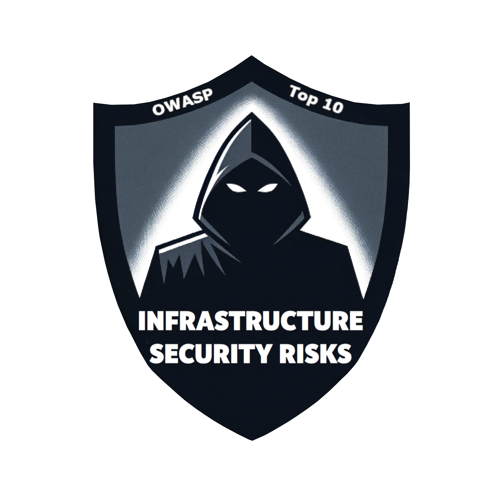

{:class="img-responsive"}{:width="750px"}{:style="display:block;margin-left:auto;margin-right:auto;"}

<h1 align="center">
OWASP Top 10 インフラストラクチャセキュリティリスク - 2024 へようこそ
</h1>

OWASP Top 10 インフラストラクチャセキュリティリスクは上位のインフラストラクチャセキュリティリスク、脅威、脆弱性に関する情報を提供します。

- [**ISR01:2024 – 古いソフトウェア (Outdated Software)**](./docs/2024/ISR01_2024-Outdated_Software.md)
- [**ISR02:2024 – 不十分な脅威検出 (Insufficient Threat Detection)**](./docs/2024/ISR02_2024-Insufficient_Threat_Detection.md)
- [**ISR03:2024 – 安全でない構成 (Insecure Configurations)**](./docs/2024/ISR03_2024-Insecure_Configurations.md)
- [**ISR04:2024 – 安全でないリソースとユーザーの管理 (Insecure Resource and User Management)**](./docs/2024/ISR04_2024-Insecure_Resource_and_User_Management.md)
- [**ISR05:2024 – 安全でない暗号技術の使用 (Insecure Use of Cryptography)**](./docs/2024/ISR05_2024-Insecure_Use_of_Cryptography.md)
- [**ISR06:2024 – 安全でないネットワークアクセス管理 (Insecure Network Access Management)**](./docs/2024/ISR06_2024-Insecure_Network_Access_Management.md)
- [**ISR07:2024 – 安全でない認証方式とデフォルトクレデンシャル (Insecure Authentication Methods and Default Credentials)**](./docs/2024/ISR07_2024-Insecure_Authentication_Methods_and_Default_Credentials.md)
- [**ISR08:2024 – 情報漏洩 (Information Leakage)**](./docs/2024/ISR08_2024-Information_Leakage.md)
- [**ISR09:2024 – リソースおよび管理コンポーネントへの安全でないアクセス (Insecure Access to Ressources and Management Components)**](./docs/2024/ISR09_2024-Insecure_Access_to_Resources_and_Management_Components.md)
- [**ISR10:2024 – 不十分な資産管理と文書化 (Insufficient Asset Management and Documentation)**](./docs/2024/ISR10_2024-Insufficient_Asset_Management_and_Documentation.md)

## 動機 - なぜ OWASP Top 10 インフラストラクチャセキュリティリスクが重要なのか？

この OWASP プロジェクトはインフラストラクチャセキュリティリスク、脅威、脆弱性に関する意識を高め、質の高い情報を提供することを目的としています。
インフラストラクチャセキュリティリスクは情報セキュリティにおいて重要な役割を果たします。
最初のアクセスの後、これらの脆弱性は企業や組織全体を侵害する主な原因となります。これらの脅威はサイバーキルチェーンにおいて重要な役割を果たしますが、攻撃ベクトルは外部ではなく内部から発生しているため、企業や組織では見過ごされることはよくあります。
企業や組織は外部への防衛線だけでは十分ではないことを念頭に置く必要があります。攻撃者がたとえばフィッシング経由でこの防衛線やその周辺を通過できて、最初のピボットポイントを取得できる場合、内部防衛メカニズムが必要です。特に内部攻撃と脅威アクターを特定するには脅威検出と監視が必要です。
これらがこのプロジェクトが生まれた理由です。私たちは有益で質の高い情報を提供し、これらの脅威全般についての意識を高めることで、世界中の企業や組織の内部セキュリティを向上したいと考えています。

## データ公募、次バージョン、貢献

OWASP Top 10 インフラストラクチャセキュリティリスクの品質と重要性をさらに改善するために、ぜひ Open Call for Data for 2024 and 2025 に参加してください。
そこでは、匿名または公開でプロジェクトにデータを寄贈できます。2024 および 2025 年中に、すべてのデータを収集して 2026 年に向けて処理します。
このようにして、さらに広範なデータセットを使用して OWASP Top 10 インフラストラクチャセキュリティリスク - バージョン 2026 を公開し、品質と重要性をさらに改善する予定です。
貢献者と寄贈者は希望に応じて関連プロジェクトページにスポンサーとして掲載されます。
また、インフラストラクチャセキュリティリスクに関する脆弱性について CVE や CWE の調査を行う予定です。
詳細や貢献方法については、この [リンク](https://github.com/OWASP/www-project-top-10-infrastructure-security-risks/tree/main/docs/2024/ISR_2024-Open_Call_for_Data.md) を参照してください。

